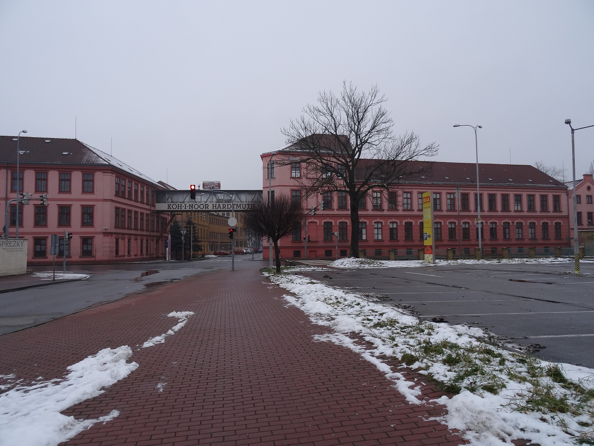
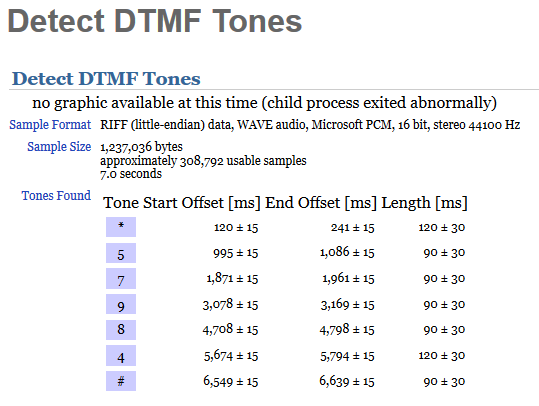
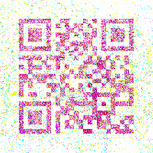
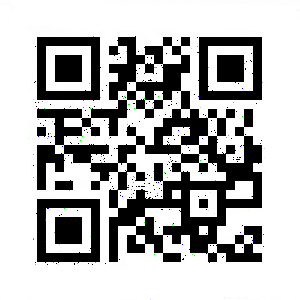
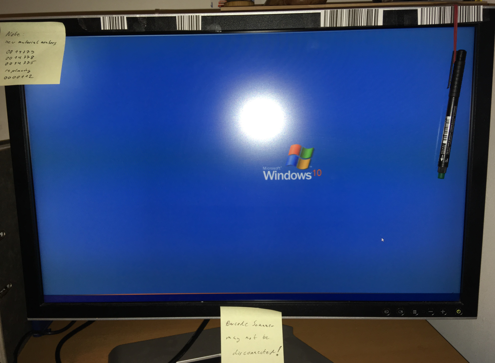
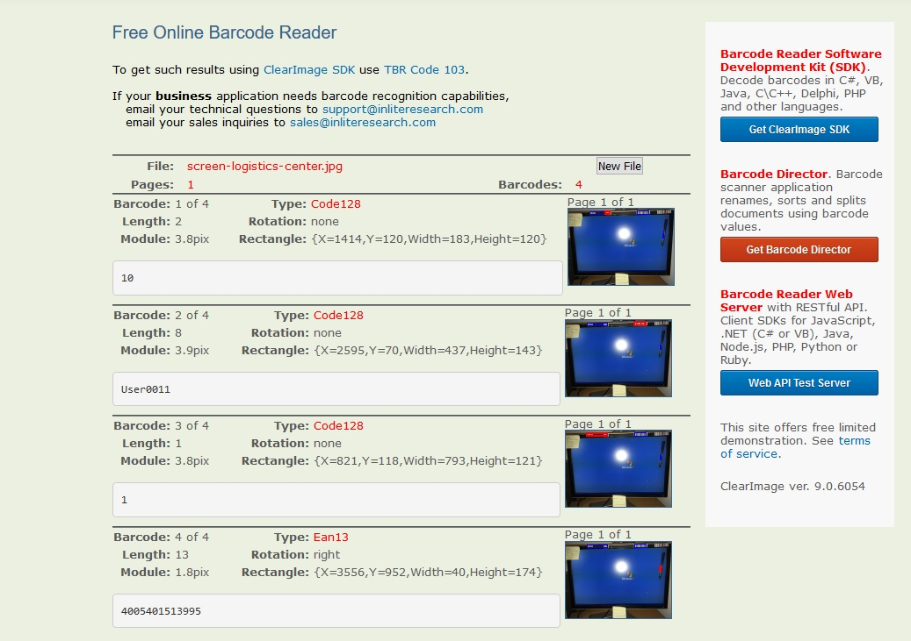
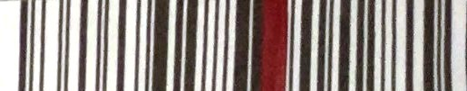
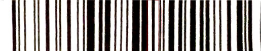
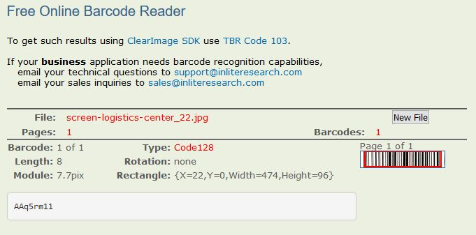
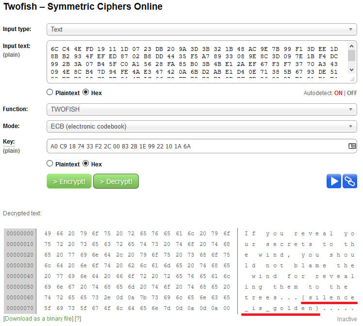

# **Syskron Security 2019**

**Date:** october 9 to 14, 2019 (CEST)

**Site:** <https://ctf2019.syskron-security.com/>

**Points:** 2821

**Rank:** 50th place out of 600 teams

---

## **TL;DR**

This was, I think, my first CtF challenge ever. I hadn't expectations in what kind of challenges I would find so my mindset was learning, learning a lot. My overall balance it's very positive, I liked a lot, although I only managed to solve 13 challenges.

The first teams was **0x90r00t** and **Gutenberg** with 8941 points, next in 3rd place **HgbSec** with 8771 points.

## **My Solves**

My overall solves it's described in the board below:

| **Challenge** | **Category** | **Value** | **Time** |
| --- | --- | --- | --- |
| [Packets are wonderful](#Packets-are-wonderful) | Forensics | 500 | October 8th, 11:18:24 PM |
| [Industrial sightseeing tour 1](#Industrial-sightseeing-tour-1) | OSINT | 100 | October 9th, 12:26:06 AM |
| [Making OPC UA secure](#Making-OPC-UA-secure) | Trivia | 10 | October 9th, 12:52:03 AM |
| [Insider attack 1](#Insider-attack-1) | Secret | 1 | October 9th, 9:34:11 AM |
| [History lesson in malware](#History-lesson-in-malware) | Trivia | 10 | October 9th, 9:50:39 AM |
| [Access the device!](#Access-the-device!) | OSINT | 200 | October 9th, 10:27:14 AM |
| [An e-mail and a link](#An-e-mail-and-a-link) | Fun | 100 | October 9th, 10:52:42 AM |
| [Insider attack 2](#Insider-attack-2)  | Secret | 300 | October 9th, 11:40:24 AM |
| [Error log](#Error-log) | Forensics | 400 | October 9th, 11:48:26 AM |
| [Using an OPC UA service](#Using-an-OPC-UA-service) | Trivia | 10 | October 9th, 8:18:40 PM |
| [Bottle inspection](#Bottle-inspection) | Forensics | 500 | October 10th, 3:02:14 PM |
| [Tracing Bitcoins](#Tracing-Bitcoins) | Trivia | 10 | October 10th, 3:34:57 PM |
| [Convenience first](#Convenience-first) | Forensics | 700 | October 10th, 4:50:13 PM |

In the last hours of the CtF I used a hint in the last OSINT challenge that costs me 20 points. Unfortunately, I couldn't manage to solve that.

The graphs below shows some statistics from my performance.


 

### **Packets are wonderful** - Forensics (500 pts)

**Description**:
> All the PLCs programs have a high information value. I just have to get it.

This is the first challenge I solved, just because it's about packets, my beloved packets :D
In about 5 minutes I found the flag, I think a easy one! Only using my all-time approach, first looking for the conversations and then to the streams.

And in the stream number 1, I found the flag. A base64 string, that sounds me suspicious. ```e3M3X3IwY2tzfQ==```

```bash
echo "e3M3X3IwY2tzfQ==" | base64 -d
{s7_r0cks}
```

### **Industrial sightseeing tour 1** - OSINT (100 pts)

**Description**:
> My friend loves factories. But she didn't tell me the location (city) of this building. Can you help me?

This OSINT challenge was very simple, it asks for the name of the city the ware placed this building.



A quick search in the google by the name `KOH-I-NOOR HARDTMUTH` leads me to the answer:

`{Ceske-Budejovice}`

### **Making OPC UA secure** - Trivia (10 pts)

**Description**:
> Which security modes are supported by OPC UA?

This question is very direct, I only have to search in the google for the answser. I search for "OPC UA security modes". In <https://documentation.unified-automation.com/uasdkhp/1.0.0/html/_l2_ua_discovery_connect.html> in the chapter related to the Initial Server Configuration we found the three security modes: None, Sign and Sign&Encrypt. That's the answer!

`{None-Sign-SignAndEncrypt}`

### **Insider attack 1** - Secret (1 pts)

**Description**:
> Hey you! My name is Serra Raaphorst, just call me Serra. I work for a Dutch manufacturing company in Den Bosch for 10 months. The first week were fine but my boss turned out to be an ultimate asshole. He started to bully me, and I started to hate him. So I decided to spy on him to discover his dirty secrets. But I need your help. You are really good in solving problems. This is the reason I contact you. I have physical access to my company, but you are the hacker. Help me!\
  \
  Answer {ok} if you are ready to proceed. This will be dangerous for us!\
  \
  P.S.: I attached an emergency code. Keep it, and use it if the time has come. Put it behind two walls.

This is the most easy one of the challenges. It's only required to accept the challenge by writting `{ok}`. :)

### **History lesson in malware** - Trivia (10 pts)

**Description**:
> Which CVE identifier describes a Windows vulnerability that was exploited by famous SCADA malware in 2010?

This challenge reports to a well-known malware that attacks a SCADA system in 2010. We are speaking of **Stuxnet**. It was required the number of the CVE for the Microsoft malware.

After a little searching in Google i found the answer, although another CVE numbers appeard in my search like this [link](https://link.springer.com/chapter/10.1007/978-3-642-35211-9_81) where it's referenced the CVE-2010-2772, CVE-2010-2729 and CVE-2010-2743. Luckily, I found a [link](https://www.symantec.com/security-center/writeup-print/2010-071400-3123-99) from Symantec that put me in the right way, idenfity the *W32.Stuxnet*.

`{cve-2010-2568}`

### **Access the device!** - OSINT (200 pts)

**Description**:
> I found this device in the control cabinet, seems to be interesting. Can you please help me find out the default username and password?


In the given image I grab some features from the device and google for the default username and password. Quickly I landed in the insys-icom Quick Installation Guide PDF, that reveals the default user and password for the device.

<http://www.insys-icom.cz/bausteine.net/f/10802/QIG_en_INSYS_MRX_LAN_190125.pdf>

`{insys-icom}`

### **An e-mail and a link** - Fun (100 pts)

**Description**:
> I got this e-mail from my colleague:\
  \
  "Hi, Tom! I know you are busy programming your S7 PLC, but you have to watch this movie Rubber! It's perfect! https://www.youtube.com/watch?v=t1WSD_cnRbA"\

This one it's a bit weird, because it was given a youtube link for a short intro of a film <https://www.youtube.com/watch?v=t1WSD_cnRbA>.

So, I realize that the flag was the only 2 words that the characters says "**No reason**"

`{no-reason}`

### **Insider attack 2** - Secret (300 pts)

**Description**:
> Thank god! I knew that I can count on you!\
  \
  We have no time to spare. My boss is in his office. I work in the adjacent room with my colleague … and four shelves. I attached some audio, recorded moments ago. Help me getting the numeric code for the safe of my boss. I can hear it but I can't decode it. My colleague watches me!\
  \
  Serra.

This was a funny challenge. The [audio file](20191009-secretarys-room.mp3) it's about a office environment with lots of talks, keyboards tones and, in the background, the DTMF tones of a safe.

So, fist of all, I searched for a DTMF decoder online and found this site: <http://dialabc.com/sound/detect/>. Uploaded the file but with no luck. So, I grabbed the Audacity tool, and started to cut the trash parts until only remains the tones of the safe.

Again I used the DTMF tool and the result it's shown in the picture below.



`{*57984#}`

### **Error log** - Forensics (400 pts)

**Description**:
> Something doesn't look right here.

This challenge consists in a log of a motor `motor-log.txt` like this:

```txt
--------------------------------------------------------------------------------
1: Sep 7 18:44:24 2019 - Motor 8 - Error code 174 - First occurrence
Motor emergency break enabled - check interface 173

--------------------------------------------------------------------------------
2: Sep 7 18:45:56 2019 - Motor 8 - Error code 174
Motor emergency break enabled - check interface 164

--------------------------------------------------------------------------------
3: Sep 7 18:46:54 2019 - Motor 8 - Error code 174
Motor emergency break enabled - check interface 150

--------------------------------------------------------------------------------
4: Sep 7 18:47:33 2019 - Motor 8 - Error code 174
Motor emergency break enabled - check interface 145

--------------------------------------------------------------------------------
5: Sep 7 18:48:50 2019 - Motor 8 - Error code 174
Motor emergency break enabled - check interface 55

--------------------------------------------------------------------------------
6: Sep 7 18:49:48 2019 - Motor 8 - Error code 174
Motor emergency break enabled - check interface 155

```

Quickly, I see that the only different information resides in the last number of each log.

```bash
cat motor-log.txt | awk ' /Motor emergency break enabled - check interface/ {print $8}'
```

So, I gather all this numbers and transform them from octal to ASCII with CyberChef.

`{the-motor-needs-to-be-replaced!}`

### **Using an OPC UA service** - Trivia (10 pts)

**Description**:
> Which service of OPC UA do you need for encrypted communication?

One more challenge which lies in the google digging. So let's search! The query "OPC UA service encrypted communication" solves the problem. The entrie <https://open62541.org/doc/0.2/services.html> or <https://opcfoundation.org/wp-content/uploads/2017/11/OPC-UA-Security-Advise-EN.pdf> led us to the solution.

`{SecureChannel}`

### **Bottle inspection**  - Forensics (500 pts)

**Description**:
> I have to calibrate the camera of our bottle inspector. We always use these sample images. Can you spot any differences?

This sounds like a steganography challenge because were given 2 similar images. But how to solve it? My every-day tools don't work, so I had to found other tool that could analyse them at the same time...so let's search.

After a quite long research I found the `StegSolve.jar` (<https://github.com/zardus/ctf-tools/blob/master/stegsolve/install>). After some play with the tool I could find a clue! A QR Code hidden after subtract the RGB colours.



Unfortunately, the QR Code was unreadable, but after some image enhancement the image was more readable and the flag pops up.



`{there-is-a-flag-in-a-bottle}`

### **Tracing Bitcoins** - Trivia (10 pts)

**Description**:
> I heard that you can make quick money with this ransomware thing. How many BTC did the three wallets used for WannaCry collect until 2019-09-09?

Like the name suggests this challenge it's about bitcoins. It asks for the amount that the wallets related to WannaCry ransomware gathered until to 09/09/2019.

I could find a thread in Reddit about this topic <https://www.reddit.com/r/Bitcoin/comments/6axuzs/wannacry_wcry_wannacrypt_bitcoin_addresses/?utm_source=share&utm_medium=web2x>. In that I could find 3 wallets.

```txt
https://blockchain.info/address/13AM4VW2dhxYgXeQepoHkHSQuy6NgaEb94

https://blockchain.info/address/12t9YDPgwueZ9NyMgw519p7AA8isjr6SMw

https://blockchain.info/address/115p7UMMngoj1pMvkpHijcRdfJNXj6LrLn
```

I only need to calculate, accordingly!

  20.04165158 BTC + 19.50274888 BTC - 0.03563 BTC + 14.84022164 BTC = 54.3489921 BTC

`{54.3489921_BTC}`

### **Convenience first** - Forensics (700 pts)

**Description**:
> If I got access to that warehouse PC, I could check out some nice items. Could you get me a valid username and password combination? It won’t be to your disadvantage.

This challenge cames with a image of a screen. Quickly I found some barcodes in it. So, the username and pass were there for sure.



Next I search for a online tool that could help me and I found this interesting site <https://online-barcode-reader.inliteresearch.com/> and upload the image.



As you can see in the image one of the barcodes shows `User0011`. It seems to be the username. But, unfortunately, one of the barcodes wasn't decrypted because of the strap that holds the pen. I tried work on it.



Looking closely, we can see the black bars behind the strap, so I tried reconstruct the barcode.



I tried decode the barcode again after this enhancements and the result is shown below.



`{User0011-AAq5rm11}`

## **Tried, but unsolved ones**

### **Schlamperei** - Crypto (200 pts)

**Description**:
> I suspect the new IoT-Gateway module, which has been installed on the machine, is sending back some data to the vendor. I was able to extract a message from the network traffic, but the content doesn't make sense. Maybe the setup archive that I found on the machine is helpful.

Almost there! This is the feeling when I see the "solution"...

At the first sight the [message.txt](message.txt) file seems to be a bunch of HEX code all together, so I moved to the zip file ([setup_customerID_9721.zip](setup_customerID_9721.zip)). But it was password protected and I've no clues about that, so the only way I seen it was brute force it. Quickly, I discover the `fcrackzip` utility and start to play with it. First, only with characters (upper and lower case, individually), then only with numbers and after that with a mix of both.

```bash
$ fcrackzip -b -c 1 -l 1-5 -v setup_customerID_9721.zip
  'setup_customerID_9721/' is not encrypted, skipping
  found file 'setup_customerID_9721/71062c43B022BE72_public-key.txt', (size cp/uc   1922/  2912, flags 1, chk 40f3)
  found file 'setup_customerID_9721/fingerprint.txt', (size cp/uc     51/    40, flags 1, chk 7ea7)
  found file 'setup_customerID_9721/License.txt', (size cp/uc     53/    41, flags 1, chk 5329)
  found file 'setup_customerID_9721/README.txt', (size cp/uc    462/   706, flags 1, chk 8bb5)
  found file 'setup_customerID_9721/sessionkey_2fishecb.txt.gpg', (size cp/uc    391/   379, flags 1, chk fac2)
  possible pw found: 9721 ()
```

Duuuh, the password it's in the filename!

As we see, the folder contains 5 files: the server keys, license and fingerprint, one encrypted file with PGP and an interesting file named `README.txt`, shown below.

```txt
F4N74571C IoT-Gateway - basic setup instructions for MFMC field engineers

Copyright MY F4N74571C M4CH1N3 C0rP (MFMC) - formerly known as V41U3 M4CH1N3 C0rP (VMC)

Valid for versions:
1.2.1 to 1.2.11
2.9 and above
3.0 and above

For initial setup at customer site perform the following steps: 
- Basic device setup according to SETUP_001.txt
- Network configuration (you can use the data provided to perform a local check before connecting to our server via internet)
- Get updates
- Run final test and get customer acceptance
- Remove installation files, including keys from system

NOTE: The old default encryption password 'VMC' has been replaced since 09/2018. Please use the new one.
```

First, I try to import the server keys, for decrypt the gpg file:

```bash
gpg --import 71062c43B022BE72_public-key.txt
```

Unfortunately, we need the passphrase to upload the secret key.

The foot note of the `README.txt` states that the password were changed by another one...but which? If the previous password were 'VMC', like the software, and the new software it's MFMC, let's try it!

It works!

So lets decrypt the message:

```bash
$ gpg -d sessionkey_2fishecb.txt.gpg
  gpg: encrypted with 2048-bit RSA key, ID 71062C43B022BE72, created 2019-09-15
  "MYF4N74571CM4CH1N3C0rP (MFMC)"
  A0 C9 18 74 33 F2 2C 00 83 2B 1E 99 22 10 1A 6A
  ```

And I were stucked here...

I found a writeup that solves this challenge by using a Twofish decrypter with the ECB mode like the filename states, using this site: <http://twofish.online-domain-tools.com/>.



`{silence_is_golden}`
