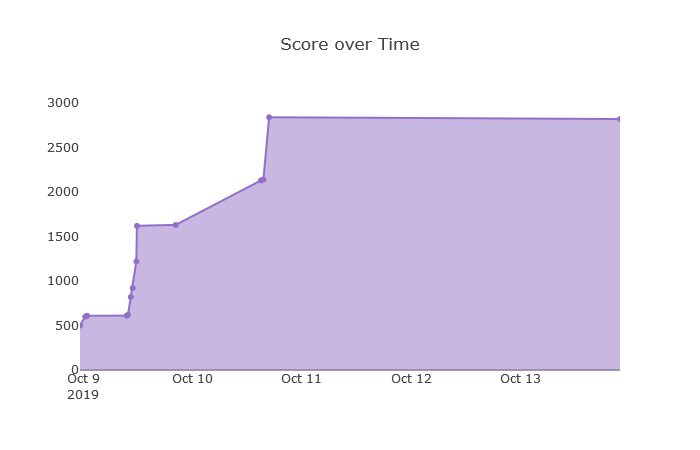
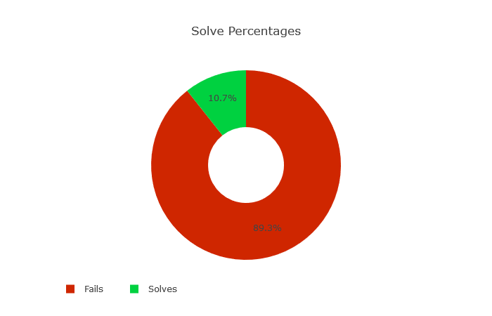
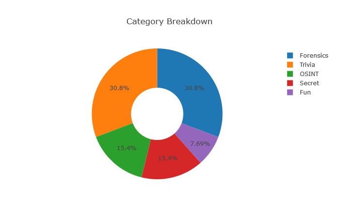

# Syskron Security 2019

**Date:** october 9 to 14, 2019 (CEST)

**Site:** <https://ctf2019.syskron-security.com/>

**Points:** 2821

**Rank:** 50th out of 600 teams

---

This was, I think, my first CtF challenge ever. I hadn't expectations in what kind of challenges I would find so my mindset was learning, learning a lot. My overall balance it's very positive, I liked a lot, although I only managed to solve 13 challenges.

The first teams was **0x90r00t** and **Gutenberg** with 8941 points, next in 3rd place **HgbSec** with 8771 points.

## My Solves

My overall solves it's described in the board below:

| **Challenge** | **Category** | **Value** | **Time** |
| --- | --- | --- | --- |
| Packets are wonderful | Forensics | 500 | October 8th, 11:18:24 PM |
| Industrial sightseeing tour 1 | OSINT | 100 | October 9th, 12:26:06 AM |
| Making OPC UA secure | Trivia | 10 | October 9th, 12:52:03 AM |
| Insider attack 1 | Secret | 1 | October 9th, 9:34:11 AM |
| History lesson in malware | Trivia | 10 | October 9th, 9:50:39 AM |
| Access the device! | OSINT | 200 | October 9th, 10:27:14 AM |
| An e-mail and a link | Fun | 100 | October 9th, 10:52:42 AM |
| Insider attack 2 | Secret | 300 | October 9th, 11:40:24 AM |
| Error log | Forensics | 400 | October 9th, 11:48:26 AM |
| Using an OPC UA service | Trivia | 10 | October 9th, 8:18:40 PM |
| Bottle inspection | Forensics | 500 | October 10th, 3:02:14 PM |
| Tracing Bitcoins | Trivia | 10 | October 10th, 3:34:57 PM |
| Convenience first | Forensics | 700 | October 10th, 4:50:13 PM |

In the last hours of the CtF I used a hint in the last OSINT challenge that costs me 20 points. Unfortunately, I couldn't manage to solve that.

The graphs below shows some statistics from my performance.

 
