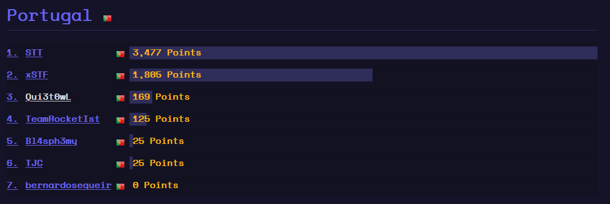

# **HackTM CTF 2020 (Quals)**

**Date:** february 1 (8am) to 3 (7:59am), 2020 (WET)

**Site:** <https://ctf.hacktm.ro/>

**Points:** 169

**Rank:** 253rd place out of 748 teams with points (1456 teams registered)

---

## **TL;DR**

Saturday night, 8pm, I was relaxed in my couch working in my new Hexo site and suddently the CTFtime site appeared in my mind. Quickly I found a running CTF and I registered in.\
Due to this "time handicap" I only managed to solve 2 challenges, but I learn a bit more.

The first team :trophy: was **#71** with 10195 points, 2nd was **pwndevils** and **NorseCode** _ex-aequo_ with 9688 points and the next team was **r3kapig** with 7457 points.

By country, from PT there were only 7 players and I finished in 3rd place, quite far from the first team (STT).



## **My Solves**

My overall solves it's described in the board below:

| **Challenge** | **Category** | **Points** | **Solved** |
| --- | --- | --- | --- |
| [Strange PCAP](#Strange-PCAP) | Forensics | 144 | #74, 1 day, 9 hours after release (2020-02-02 17:42:54) |
| [Romanian Gibberish](#Romanian-Gibberish) | Misc | 25 | #691, 1 day, 11 hours after release (2020-02-02 19:21:45) |

### **Strange PCAP** - Forensics (144pts)

**Description**:
> We managed to get all the data to incriminate our CEO for selling company secrets. Can you please help us and give us the secret data that he has leaked?\
\
Author: Legacy

This challenge has been solved by 9.3% of actively participating users (89).

The pcap file was a USB capture and contained captures from a USB Removable Disk and one keyboard input.\
The first thing I did was grepping the keyboard input using the script used in my last HTB challenge. But firstly I extracted the _**Leftover Capture Data**_.

```bash
root@kali:/mnt/hgfs/vm_folder/HackTM# tshark -r Strange.pcapng -Y "usb.transfer_type == 0x01 && usb.bInterfaceClass==3 && usb.src == \"1.15.1\"" -T fields -e usb.capdata > data.txt

root@kali:/mnt/hgfs/vm_folder/HackTM# python decrypt_usb.py

7vgj4SSL9NHVuK0D6d3F
```

It wasn't the flag, so I searched in the USB device. Digging in the USB device I found a reference to a file named "Flag.txt" and a Zip file, so I used the _**binwalk**_ to carve the files.

```bash
root@kali:/mnt/hgfs/vm_folder/HackTM# binwalk -Mve Strange.pcapng 

Scan Time:     2020-02-02 17:39:11
Target File:   /mnt/hgfs/vm_folder/HackTM/Strange.pcapng
MD5 Checksum:  ccd21d48fd04137551833d2e4493243e
Signatures:    386

DECIMAL       HEXADECIMAL     DESCRIPTION
--------------------------------------------------------------------------------
8020775       0x7A6327        Zip archive data, encrypted at least v2.0 to extract, compressed size: 77, uncompressed size: 72, name: Flag.txt
8020980       0x7A63F4        End of Zip archive, footer length: 22


Scan Time:     2020-02-02 17:39:16
Target File:   /mnt/hgfs/vm_folder/HackTM/_Strange.pcapng-1.extracted/Flag.txt
MD5 Checksum:  d41d8cd98f00b204e9800998ecf8427e
Signatures:    386

DECIMAL       HEXADECIMAL     DESCRIPTION
--------------------------------------------------------------------------------
```

Opened the zip file and asks for a password, I tried the input of the keyboard and I succed. The `Flag.txt` file had the flag:

`HackTM{88f1005c6b308c2713993af1218d8ad2ffaf3eb927a3f73dad3654dc1d00d4ae}`

### **Romanian Gibberish** - Misc (25pts)

**Description**:
> https://en.wikipedia.org/wiki/Gibberish_(language_game)\
\
HapackTM{Wepelcopomepe_Topo_HAPACKTMCTF_2020!}

This challenge has been solved by 74.1% of actively participating users (711).

This one there's no need of explanations.

`HackTM{Welcome_To_HACKTMCTF_2020!}`
