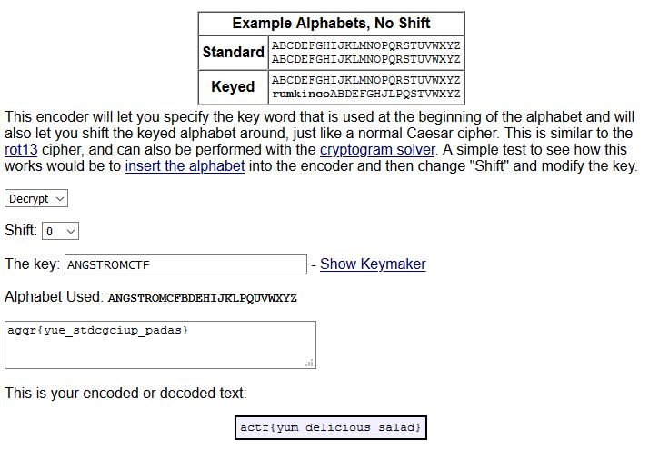

# **ångstromCTF 2020**

**Date:** march 14 (12am) to 19 (12am), 2020 (WET)

**Site:** <https://2020.angstromctf.com/>

**Points:** 575

**Rank:** 592nd place out of 1596 teams with points (1782 teams registered)

---

## **TL;DR**

Because the Covid-19 quarantine time, I decided stay at home this weekend instead of visiting my parents in my birth town. It was a good plan playing some CtF!
Firstly I was thinking CtF only lasts in the weekend, but in monday I realised that it ends in wednesday. Cool, I had time for solving more challenges (3)! :smile:

Unfortunately, I went running out of time when I could found the solution for ws3 challenge. But I was so close...

In first place ended up the **tohru lovers** and the **justCatTheFish** _ex-aequo_ with 5465 points :trophy:, and in 3rd place was **redpwn** with 5195 points. I'm very proud for portuguese :pt: team **STT** reach que 9th place.

In the 100 first teams I found 4 portuguese teams :strong: : **STT** (9th), **xSTF** (43rd) and **TeamRocketIst** (53rd) and **Root Lee** (92nd).

So far, it was the nicest CtF I had entered.

## **My Solves**

My overall solves it's described in the board below:

| **Challenge** | **Category** | **Points** | **Time** |
| --- | --- | --- | --- |
| [Sanity Check](#Sanity-Check) | Misc | 5 | 3/14/2020, 10:58:09 AM |
| [ws1](#ws1) | Misc | 30 | 3/14/2020, 7:03:29 PM |
| [ws2](#ws2) | Misc | 80 | 3/14/2020, 7:09:24 PM |
| [The Magic Word](#The-Magic-Word) | Web | 20 | 3/14/2020, 10:56:51 PM |
| [Shifter](#Shifter) | Misc | 160 | 3/15/2020, 12:57:54 PM |
| [Keysar](#Keysar) | Crypto | 40 | 3/16/2020, 11:13:10 PM |
| [Reasonably Strong Algorithm](#Reasonably-Strong-Algorithm) | Crypto | 70 | 3/17/2020, 12:02:13 AM |
| [Windows of Opportunity](#Windows-of-Opportunity) | Rev | 50 | 3/17/2020, 1:49:17 AM |
| [Revving Up](#Revving-Up) | Rev | 50 | 3/18/2020, 9:09:38 PM |
| [Taking Off](#Taking-Off) | Rev | 70 | 3/18/2020, 9:09:55 PM |
| [ws3](#ws3) | Misc | 180 | 3/19/2020, 12:16:56 AM (Out of time) |

### **Sanity Check** - Misc (5pts)

**Description**:
> Join our Discord! <https://discord.gg/Dduuscw> \
\
Author: aplet123

This challenge had 1013 solves.

This was easy it's only join the Discord channel and grab the flag in the comments part of the topic #general.


`actf{never_gonna_let_you_down}`

### **ws1** - Misc (30pts)

**Description**:
> Find my password from this [recording](./recording1.pcapng) (:\
\
Author: JoshDaBosh

This challenge had 1248 solves.

This is a easy wireshark challenge that you only need search in the packets by the string `actf` _et voilà_!\
The flag appears in the packet #17, a POST transaction with the flag as a `Key` and the `actf{wireshark_isn't_so_bad_huh-a9d8g99ikdf}` as a `Value`.

`actf{wireshark_isn't_so_bad_huh-a9d8g99ikdf}`

### **ws2** - Misc (80pts)

**Description**:
> No ascii, not problem :)\
\
[recording.pcapng](./recording2.pcapng)\
\
Author: JoshDaBosh\
\
Hint: What _did_ I send?

This challenge had 828 solves.

Another Wireshark challenge, but this one was a little difficult. Navigate in the File > Export Object > HTTP of Wireshark you see a `multipart/form-data object` with 102kB of data, whichs corresponds to a packet #54. Exploring the packet #54 you see a jpeg file with the name `flag.jpg`. Exports this stream and get the flag.


`actf{ok_to_b0r0s_4809813}`

### **The Magic Word** - Web (20pts)

**Description**:
> [Ask and you shall receive](https://magicword.2020.chall.actf.co/)...that is as long as you use the magic word.\
\
Author: aplet123\
\
Hint: Change "give flag" to "please give flag" somehow.

This challenge had 1337 solves.

This is a kind of challenges that I don't play, but I usually try the easiest ones.

So the url provided leds me to a site with the statement `give flag` in that. The first thing I did was check the source code:

```html
<!DOCTYPE html>
<html lang="en">
    <head>
        <meta charset="UTF-8" />
        <meta name="viewport" content="width=device-width, initial-scale=1.0" />
        <title>What's the magic word?</title>
        <link
            href="https://fonts.googleapis.com/css2?family=Inconsolata:wght@400;700&display=swap"
            rel="stylesheet"
        />
        <style>
        </style>
    </head>
    <body>
        <div>
            <p class="hidden">this ain't it chief</p>
        </div>
        <div>
            <p class="hidden">this also ain't it chief</p>
        </div>
        <div>
            <div class="flexmagic">
                <p id="magic">give flag</p>
            </div>
        </div>
        <div>
            <p class="hidden">you passed it chief</p>
        </div>
        <script>
            var msg = document.getElementById("magic");
            setInterval(function() {
                if (magic.innerText == "please give flag") {
                    fetch("/flag?msg=" + encodeURIComponent(msg.innerText))
                        .then(res => res.text())
                        .then(txt => magic.innerText = txt.split``.map(v => String.fromCharCode(v.charCodeAt(0) ^ 0xf)).join``);
                }
            }, 1000);
        </script>
    </body>
</html>

```

Huummmm interesting the snipped of `javascript`...It only needs to had the text "**please give flag**" in that to give the flag. So let's change it in:

```html
<p id="magic">give flag</p>
```

With the developer tools of the browser we could do that, and instantly we got the flag!

`actf{1nsp3c7_3l3m3nt_is_y0ur_b3st_fri3nd}`

### **Shifter** - Misc (160pts)

**Description**:
> What a strange challenge...\
It'll be no problem for you, of course!\
\
`nc misc.2020.chall.actf.co 20300`\
\
Author: JoshDaBosh\
\
Hist: Do you really need to calculate all those numbers?

This challenge had 461 solves.

This is one of the more challenging challs I've done in this CtF because it was the first time I wrote a script to solve this.\
So we had the interaction that follows:

```bash
$ nc misc.2020.chall.actf.co 20300
Solve 50 of these epic problems in a row to prove you are a master crypto man like Aplet123!
You'll be given a number n and also a plaintext p.
Caesar shift `p` with the nth Fibonacci number.
n < 50, p is completely uppercase and alphabetic, len(p) < 50
You have 60 seconds!
--------------------
Shift GSRJOZZBPTAIEOISNWCZHROWQTLLBHBIAMQX by n=1
: AAA
Sorry, you got it wrong. The answer was HTSKPAACQUBJFPJTOXDAISPXRUMMCICJBNRY. Better luck next time!
```

So we need to make a script that reads and parses 50 plaintext problems, decrypt them shifting n steps right based in the nth Fibonacci number.\
In the example above we need to shift `GSRJOZZBPTAIEOISNWCZHROWQTLLBHBIAMQX` using the 1st Fibonacci number that is 1. So the `G` becomes a `H`, the `S` an `T` and so on.

```python
def decrypt(key, message):

    LETTERS = 'ABCDEFGHIJKLMNOPQRSTUVWXYZ'
    translated = ''

    for symbol in message:
        if symbol in LETTERS:
            num = LETTERS.find(symbol)
            num = num + key
            if num > 25:
                num = num - len(LETTERS)
            translated = translated + LETTERS[num]
        else:
            translated = translated + symbol

    return translated
```

But there's a problem when the number it's greater tham 26 (the number of alphabet letters), we have to reset the counter. To deal with this we get the rest of the division by 26 and get the number of shifts.

```python
def modulos(n):
    if n > 26:
        j = n % 26
    else:
        j = n

    return j
```

After that we only need to do a `while` loop to through out the 50 problems.

```python
r = remote('misc.2020.chall.actf.co', 20300)

a = 1
while a < 51:
    r.recvuntil('Shift ')
    p = r.recvuntil(' ') # Here is the message
    print('Message = '+str(p.strip()))
    r.recvuntil('by n=')
    n = r.recvuntil('\n') # Here is nth Fibonacci sequence number
    message = p.strip() # remove the trailing space

    k = fibonacci(int(n.strip())) # Determine the Fibonacci number
    l = modulos(k) # Check if the number is greater than 26
    m = decrypt(l,str(message)) # Decrypt the message
    m = str(m).strip('b').strip("'")
    r.send(m+'\n') # Send the decrypted message back

    a += 1
r.interactive()
```

Here is the [full script](./fib_seq.py) and the result was shown below.

```bash
$ python3 ./fib_seq.py
[+] Opening connection to misc.2020.chall.actf.co on port 20300: Done
Message = b'VZJUWCREQINJSLDRAREVM'
Message = b'EPUBTGYXULLGZ'
Message = b'WRBDMDWKRYWCDKXPMO'
Message = b'ONINPXOEXVTCLJWDHVTVYYEXPEHPMGWCDJ'
Message = b'JXWIRASAAWPHQRNHKZAAFEDTYAIMCSQGQDXBKVKODWPKG'

...

Message = b'YOECLO'
Message = b'NDFXRFMXZPKVQGKNBNGWETDKTWDJFQVVLMEFOORMGYJNARM'
Message = b'HYKNFQROU'
Message = b'FQCISISJJUCBTLDHMHDZTFEQFPOBRSXSJSAFK'
Message = b''
[*] Switching to interactive mode
: actf{h0p3_y0u_us3d_th3_f0rmu14-1985098}
[*] Got EOF while reading in interactive
```

`actf{h0p3_y0u_us3d_th3_f0rmu14-1985098}`

### **Keysar** - Crypto (40pts)

**Description**:
> Hey! My friend sent me a message... He said encrypted it with the key ANGSTROMCTF.
\
He mumbled what cipher he used, but I think I have a clue.\
\
Gotta go though, I have history homework!!\
\
agqr{yue_stdcgciup_padas}\
\
Author: joshdabosh\
\
Hint: Keyed caesar, does that even exist??

This challenge had 890 solves.

The first thing that came into my head was the vigenère cipher, because the key provided. Quickly I found that I was wrong. So I starting Googling for another ciphers with the hint in my mind.

I found a site called [rumkin](http://rumkin.com/tools/cipher/caesar-keyed.php) that solved my problem and explain how this variation of the Caesar cipher works.



`actf{yum_delicious_salad}`

### **Reasonably Strong Algorithm** - Crypto (70pts)

**Description**:
> [RSA](./rsa.txt) strikes again!\
\
Author: lamchcl\
\
Hint: After you get a number, you still have to get a flag from that.

This challenge had 759 solves.

Another easy one challenge if you had the rigth tools. In the case the [RsaCtfTool framework.](https://github.com/Ganapati/RsaCtfTool)\
After analysing the file I had the `n`, `e` and `c` variables of the RSA cipher.

```text
n = 126390312099294739294606157407778835887
e = 65537
c = 13612260682947644362892911986815626931
```

So I only had to use it!

```bash
RsaCtfTool$ python RsaCtfTool.py -n 126390312099294739294606157407778835887 -e 65537 --uncipher 13612260682947644362892911986815626931
[+] Clear text :  actf{10minutes}
```

`actf{10minutes}`

### **Windows of Opportunity** - Rev (50pts)

**Description**:
> Clam's a windows elitist and he just can't stand seeing all of these linux challenges! So, he decided to step in and create [his own rev challenge](./windows_of_oportunity.exe) with the "superior" operating system.\
\
Author: aplet123\
\
Hint: You can probably solve it just by looking at the disassembly.

This challenge had 784 solves.

Another easy one challenge, because my first approach in the files is running the `strings` command on it.

```bash
$ strings windows_of_oportunity.exe | grep actf
bactf{ok4y_m4yb3_linux_is_s7ill_b3tt3r}

```

`actf{ok4y_m4yb3_linux_is_s7ill_b3tt3r}`

### **Revving Up** - Rev (50pts)

**Description**:
> Clam wrote a [program](./revving_up) for his school's cybersecurity club's first rev lecture! Can you get it to give you the flag? You can find it at `/problems/2020/revving_up` on the shell server, which you can access via the "shell" link at the top of the site.\
\
Author: aplet123\
\
Hint: Try some google searches for "how to run a file in linux" or "bash for beginners".

This challenge had 938 solves.

I have to addmit that reverse engineering it's my Achilles anckle, but this time I give it an oportunity.

First I run the program in the CtF shell.

```bash
team5770@actf:/problems/2020/revving_up$ ./revving_up
Congratulations on running the binary!
Now there are a few more things to tend to.
Please type "give flag" (without the quotes).
give flag
Good job!
Now run the program with a command line argument of "banana" and you'll be done!
```

Woow only this...?!
So I only need to pass the argument "banana" in the command line, that's it?. Let's try.

```bash
team5770@actf:/problems/2020/revving_up$ ./revving_up banana
Congratulations on running the binary!
Now there are a few more things to tend to.
Please type "give flag" (without the quotes).
give flag
Good job!
Well I think it's about time you got the flag!
actf{g3tting_4_h4ng_0f_l1nux_4nd_b4sh}
```

`actf{g3tting_4_h4ng_0f_l1nux_4nd_b4sh}`

### **Taking Off** - Rev (70pts)

**Description**:
> So you started revving up, but is it enough to [take off](./taking_off)? Find the problem in `/problems/2020/taking_off/` in the shell server.\
\
Author: aplet123\
\
You should look into tools like GHIDRA, `gdb`, and `objdump`.

This challenge had 521 solves.

With a little confidence I diving in this challenge using the same technique like previous chall: running the program.

```bash
team5770@actf:/problems/2020/taking_off$ ./taking_off
So you figured out how to provide input and command line arguments.
But can you figure out what input to provide?
Make sure you have the correct amount of command line arguments!
```

Hummm I need to pass some arguments to the program. So this time I had to realy reverse the program.\
Reverse Engineering it's not my "beloved one" in CtF...but this time I give a try. I read some writeups and tutorials about using `GHIDRA`, `R2` and `gdb` and start reverse.
I start with Ghidra, that did a good job identifying the code in `main` function.

```c

undefined8 main(int param_1,long param_2)

{
  int iVar1;
  undefined8 uVar2;
  size_t sVar3;
  long in_FS_OFFSET;
  uint local_b4;
  uint local_b0;
  uint local_ac;
  int local_a8;
  int local_a4;
  char *local_a0;
  byte local_98 [136];
  long local_10;
  
  local_10 = *(long *)(in_FS_OFFSET + 0x28);
  puts("So you figured out how to provide input and command line arguments.");
  puts("But can you figure out what input to provide?");
  if (param_1 == 5) {
    string_to_int(*(undefined8 *)(param_2 + 8),&local_b4,&local_b4);
    string_to_int(*(undefined8 *)(param_2 + 0x10),&local_b0,&local_b0);
    string_to_int(*(undefined8 *)(param_2 + 0x18),&local_ac,&local_ac);
    iVar1 = is_invalid((ulong)local_b4);
    if (iVar1 == 0) {
      iVar1 = is_invalid((ulong)local_b0);
      if (iVar1 == 0) {
        iVar1 = is_invalid((ulong)local_ac);
        if ((iVar1 == 0) && (local_ac + local_b0 * 100 + local_b4 * 10 == 0x3a4)) {
          iVar1 = strcmp(*(char **)(param_2 + 0x20),"chicken");
          if (iVar1 == 0) {
            puts("Well, you found the arguments, but what\'s the password?");
            fgets((char *)local_98,0x80,stdin);
            local_a0 = strchr((char *)local_98,10);
            if (local_a0 != (char *)0x0) {
              *local_a0 = '\0';
            }
            sVar3 = strlen((char *)local_98);
            local_a4 = (int)sVar3;
            local_a8 = 0;
            while (local_a8 <= local_a4) {
              if ((local_98[local_a8] ^ 0x2a) != desired[local_a8]) {
                puts("I\'m sure it\'s just a typo. Try again.");
                uVar2 = 1;
                goto LAB_00400bc7;
              }
              local_a8 = local_a8 + 1;
            }
            puts("Good job! You\'re ready to move on to bigger and badder rev!");
            print_flag();
            uVar2 = 0;
            goto LAB_00400bc7;
          }
        }
      }
    }
    puts("Don\'t try to guess the arguments, it won\'t work.");
    uVar2 = 1;
  }
  else {
    puts("Make sure you have the correct amount of command line arguments!");
    uVar2 = 1;
  }
LAB_00400bc7:
  if (local_10 != *(long *)(in_FS_OFFSET + 0x28)) {
                    /* WARNING: Subroutine does not return */
    __stack_chk_fail();
  }
  return uVar2;
}
```

After spend a little time analysing the program I could realize that we need to input 3 parameters and the string "chicken". After that we need to input the password.

The line `if ((iVar1 == 0) && (local_ac + local_b0 * 100 + local_b4 * 10 == 0x3a4))` checks if our input it's equal to `0x3a4` that corresponds `932` in decimal, because of multiplications: `local_b0` = **9**, `local_b4` = **3** and `local_ac` = **2**.

Now we decipher the 3 first arguments, we only had to pay attention to the order of appearence in the initial `if` verification: local_b4, local_b0 and local_ac.

```bash
team5770@actf:/problems/2020/taking_off$ ./taking_off 3 9 2 chicken
So you figured out how to provide input and command line arguments.
But can you figure out what input to provide?
Well, you found the arguments, but what's the password?
test
I'm sure it's just a typo. Try again.
```

Now we are in this line `if ((local_98[local_a8] ^ 0x2a) != desired[local_a8])` that compares our password to the right one in the `desired` location. So let's move to the `desired` position of memory and check what we have.


Nice, we have 17 positions in hexadecimal, so let's XORing each those positions with `0x2a`...

```bash
$ echo -n '\x5a\x46\x4f\x4b\x59\x4f\x0a\x4d\x43\x5c\x4f\x0a\x4c\x46\x4b\x4d\x2a' | ./xcat.py -x 2a
please give flag
```

And here we have the password: `please give flag`

```bash
team5770@actf:/problems/2020/taking_off$ ./taking_off 3 9 2 chicken
So you figured out how to provide input and command line arguments.
But can you figure out what input to provide?
Well, you found the arguments, but what's the password?
please give flag
Good job! You're ready to move on to bigger and badder rev!
actf{th3y_gr0w_up_s0_f4st}
```

`actf{th3y_gr0w_up_s0_f4st}`

### **ws3** - Misc (180pts)

**Description**:
> What the... [record.pcapng](./record.pcapng)\
\
Author: JoshDaBosh\
\
Hint: Did I _send_ something? Or...

This challenge had 278 solves.

This was a chall that broke my mind since I opened it. The first part was easy, because had an pcap file and I could apply my skills in Wireshark. Quickly I found some git commands in it.


Looking carefully the stream #76 looks interesting in size: 18kB. So I extracted this stream and run binwalk there.

```bash
vagrant@packer-vmware-iso:/mnt/hgfs/mech/angstrom_ctf$ binwalk -Mve git-receive-pack

Scan Time:     2020-03-29 21:36:17
Target File:   /mnt/hgfs/mech/angstrom_ctf/git-receive-pack
MD5 Checksum:  2e8492881c21fc9964ba568da805a096
Signatures:    391

DECIMAL       HEXADECIMAL     DESCRIPTION
--------------------------------------------------------------------------------
183           0xB7            Zlib compressed data, default compression
342           0x156           Zlib compressed data, default compression
425           0x1A9           Zlib compressed data, default compression


Scan Time:     2020-03-29 21:36:17
Target File:   /mnt/hgfs/mech/angstrom_ctf/_git-receive-pack.extracted/B7
MD5 Checksum:  2151a7e29883f30ccaac44fe12962e61
Signatures:    391

DECIMAL       HEXADECIMAL     DESCRIPTION
--------------------------------------------------------------------------------


Scan Time:     2020-03-29 21:36:17
Target File:   /mnt/hgfs/mech/angstrom_ctf/_git-receive-pack.extracted/156
MD5 Checksum:  ca24f7f5dd98480509add47aef5085b1
Signatures:    391

DECIMAL       HEXADECIMAL     DESCRIPTION
--------------------------------------------------------------------------------


Scan Time:     2020-03-29 21:36:17
Target File:   /mnt/hgfs/mech/angstrom_ctf/_git-receive-pack.extracted/1A9
MD5 Checksum:  2f802777f5aa24023f9de8af81c65185
Signatures:    391

DECIMAL       HEXADECIMAL     DESCRIPTION
--------------------------------------------------------------------------------
0             0x0             JPEG image data, JFIF standard 1.01

```

The last extraction returns a JPEG file. Let's see the output ouf extraction.

```bash
vagrant@packer-vmware-iso:/mnt/hgfs/mech/angstrom_ctf/_git-receive-pack.extracted$ ls -lah
total 85K
drwxrwxrwx 1 root root 4.0K Mar 29 21:36 .
drwxrwxrwx 1 root root 8.0K Mar 29 21:36 ..
-rwxrwxrwx 1 root root   73 Mar 29 21:36 156
-rwxrwxrwx 1 root root  18K Mar 29 21:36 156.zlib
-rwxrwxrwx 1 root root  19K Mar 29 21:36 1A9
-rwxrwxrwx 1 root root  18K Mar 29 21:36 1A9.zlib
-rwxrwxrwx 1 root root  228 Mar 29 21:36 B7
-rwxrwxrwx 1 root root  18K Mar 29 21:36 B7.zlib

vagrant@packer-vmware-iso:/mnt/hgfs/mech/angstrom_ctf/_git-receive-pack.extracted$ cat 156
100644 README.md���Ǭ�H���'�Se��T�>100644 flag.jpg�?G��:��FЪՒY����c�

vagrant@packer-vmware-iso:/mnt/hgfs/mech/angstrom_ctf/_git-receive-pack.extracted$ cat 1A9
����JFIFHH��C


▒▒ $.' ",#(7),01444'9=82<.342��C


!1AQaq"2�#BR���3Cbr�$S���4c%su��&'678DTft����������222�%�"���Q
                                                   ?�I$�c���+*
                                                              l|�c沉�����h���6>k(�1��M���&�l|�c沉�����h���6>k(�1��M���&�l|�c沉�����h���6>k(�1��M���&�l|�c沉�����h���6>k(�1��M���&�l|�c沉�����h���6>k(�1��M���&�l|�c沉�����h���6>k(�1��M���&�l|�A��>��VV�VR�"��������������������������������������Do���`|�e`|�e(""������������������������������������tF����VV�VR�"�����������4�V���#Y�{��U�s��K�x��,�▒)���iK�ȓ�
`��}�V�h�s��g�9ӎ�㹥S��Ȫ'�]w�0���j�oo{▒��}�)g��g;���d���▒5�:{���>���^O�V��t�.>� �|���<�6��s��5������bM��}Y�8�'V�,{�����g����S�N�|        �h,q�\X~�*"L����Q�����Gѕ�QX;�5�o���m��yJ����5RQq�[�����G������u�'Z�ؼG')L^/��;*����ZS������Rz��]�>푫6�ݜ�?�Tu�

```

The JFIF word it's the magic byte for a JPEG file. So let's rename the file and open it.


`actf{git_good_git_wireshark-123323}`
